# Gurgaon Real Estate Market Analysis

## Project Overview

This project analyzes residential property listings in Gurgaon to identify pricing trends, premium localities, builder influence, RERA impact, and overall market behavior.

The analysis was performed using Python, Pandas, Matplotlib, and Seaborn in Jupyter Notebook using VS Code.

This project focuses on Exploratory Data Analysis (EDA) to generate meaningful business insights from real-world real estate data.

---

## Problem Statement

A real estate advisory firm operating in Gurgaon collected residential property data across multiple sectors and localities.

The goal of this analysis is to help buyers, investors, and developers make data-driven decisions by analyzing:

- Property pricing trends
- Locality-wise pricing
- Builder influence
- RERA approval impact
- Property type analysis
- Area vs pricing relationship

---

## Business Questions Answered

- Which is the costliest flat in the dataset?
- Which locality has the highest average property price?
- Which locality has the highest rate per square foot?
- Do ready-to-move properties cost more than under-construction properties?
- Do RERA-approved properties command a price premium?
- How does area impact property price?
- Which BHK configuration is the most expensive?
- Which property type is the costliest?
- Do certain builders consistently price properties higher?
- Are larger homes always more expensive per square foot?

---

## Tools & Technologies Used

- Python
- Pandas
- NumPy
- Matplotlib
- Seaborn
- Jupyter Notebook
- VS Code

---

## Dataset Information

The dataset contains residential property listings from Gurgaon including:

- Property Price
- Area (Sqft)
- Rate per Sqft
- BHK Configuration
- Property Type
- Builder Details
- RERA Approval Status
- Locality Information
- Property Status

---

## Project Structure

```text
3_REAL-ESTATE-ANALYSIS/
│
├── data/
│   └── real_estate_data.csv
│
├── images/
│   ├── area_vs_price_scatter.png
│   ├── area_vs_rate_per_sqft.png
│   ├── avg_price_by_bhk.png
│   ├── correlation_heatmap.png
│   ├── median_price_by_rera.png
│   ├── median_price_by_status.png
│   ├── property_price_distribution.png
│   ├── property_price_outliers.png
│   ├── top_builders_avg_price.png
│   ├── top_localities_by_listings.png
│   ├── top_property_type_price.png
│   ├── top10_builders_avg_price.png
│   ├── top10_locality_prices.png
│   ├── top10_locality_rate.png
│   └── powerbi_dashboard.png
│
├── notebooks/
│   ├── gurgaon_real_estate_analysis.ipynb
│   └── gurgaon_real_estate_analysis.html
│
├── Gurgaon_Real_Estate_Dashboard.pbix
└── README.md
```

---

## Data Cleaning Process

The following preprocessing steps were performed:

- Standardized column names
- Converted numeric columns
- Removed duplicates
- Cleaned categorical values
- Handled missing values
- Fixed inconsistent formatting

---

## Exploratory Data Analysis (EDA)

The project includes:

- Locality-wise pricing analysis
- Rate per sqft analysis
- Builder analysis
- BHK pricing analysis
- Property type comparison
- Area vs price relationship
- Correlation analysis
- Outlier detection
- Distribution analysis

---

# Visualizations

## Top Localities by Average Price

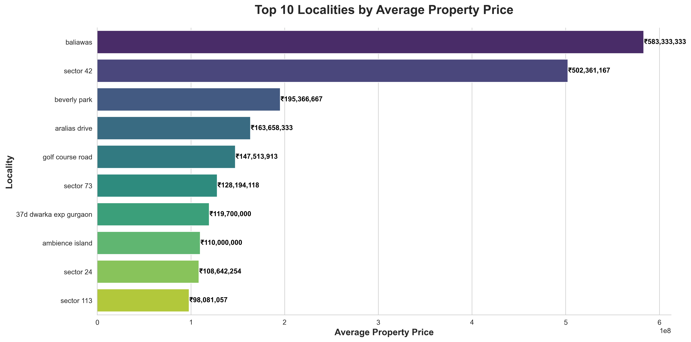

---

## Top Localities by Rate per Sqft

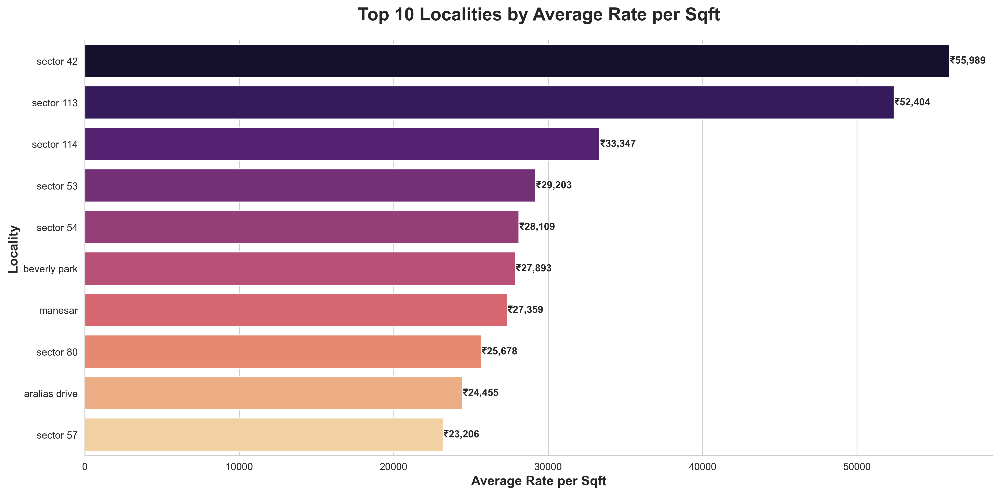

---

## Correlation Heatmap

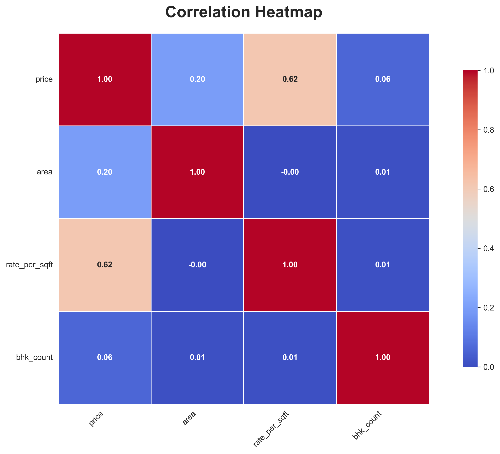

---

## Area vs Property Price

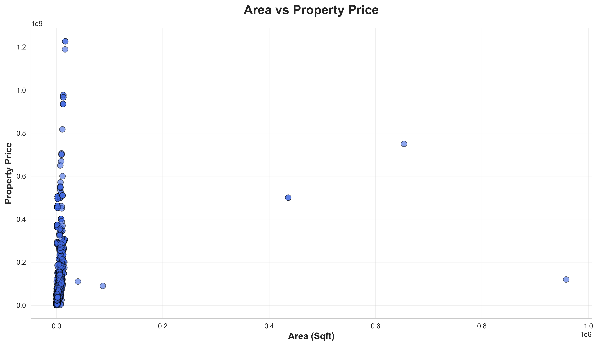

---

## Area vs Rate per Sqft

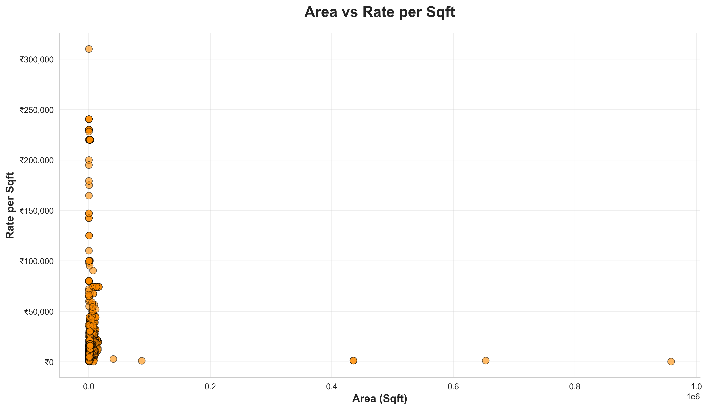

---

## Average Price by BHK

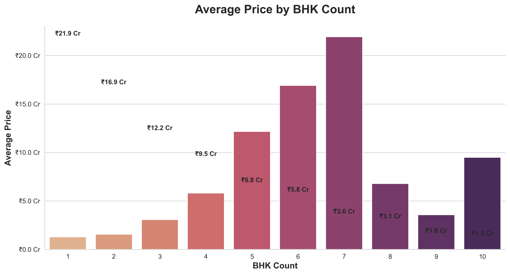

---

## Average Price by Property Type


---

## Builder Pricing Analysis

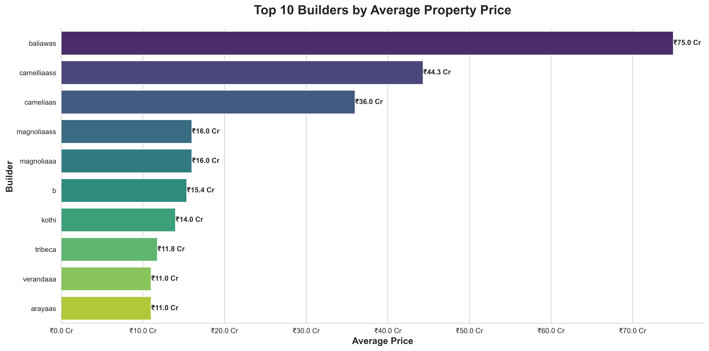

---

## Property Price Distribution

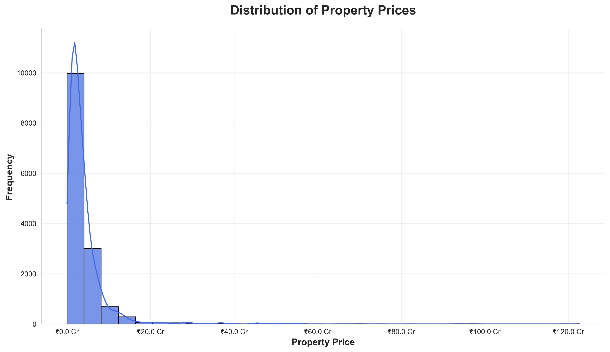

---

## Property Price Outliers

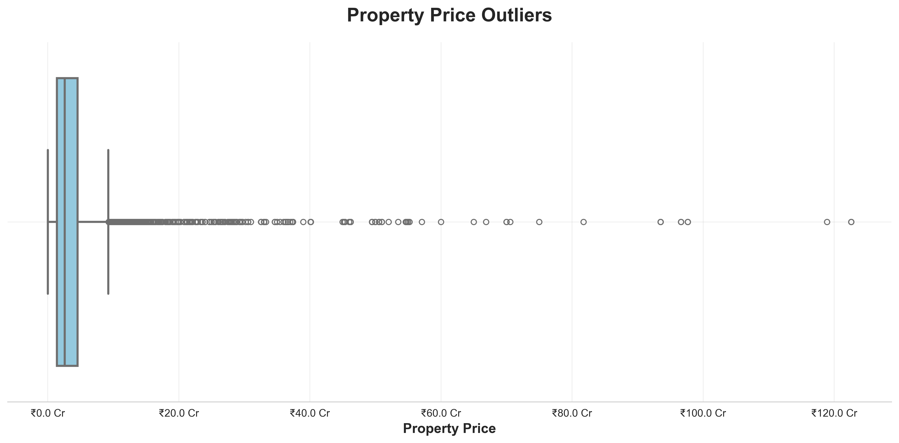

---

## Median Price by RERA Approval

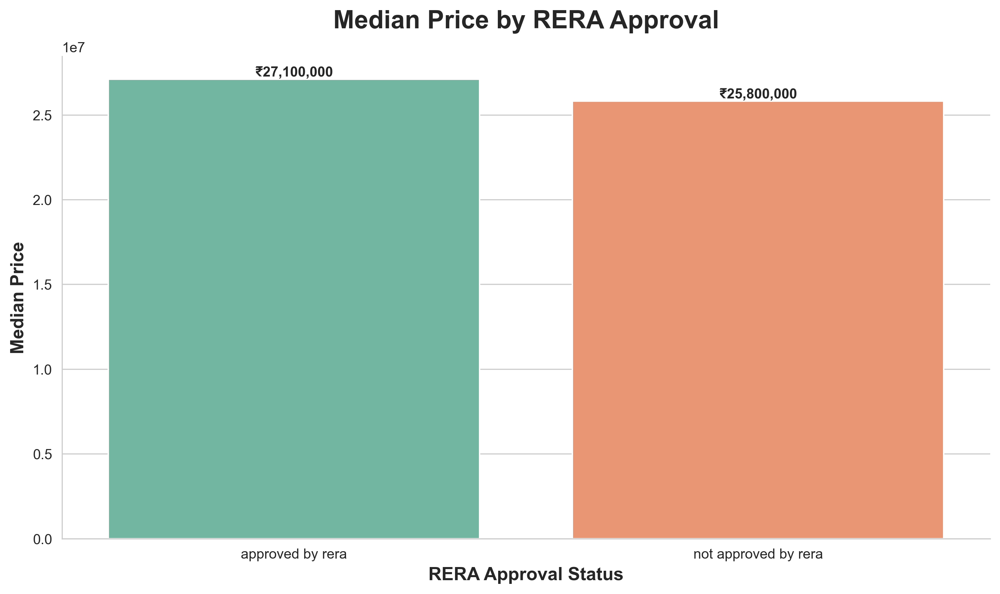

---

## Median Price by Property Status

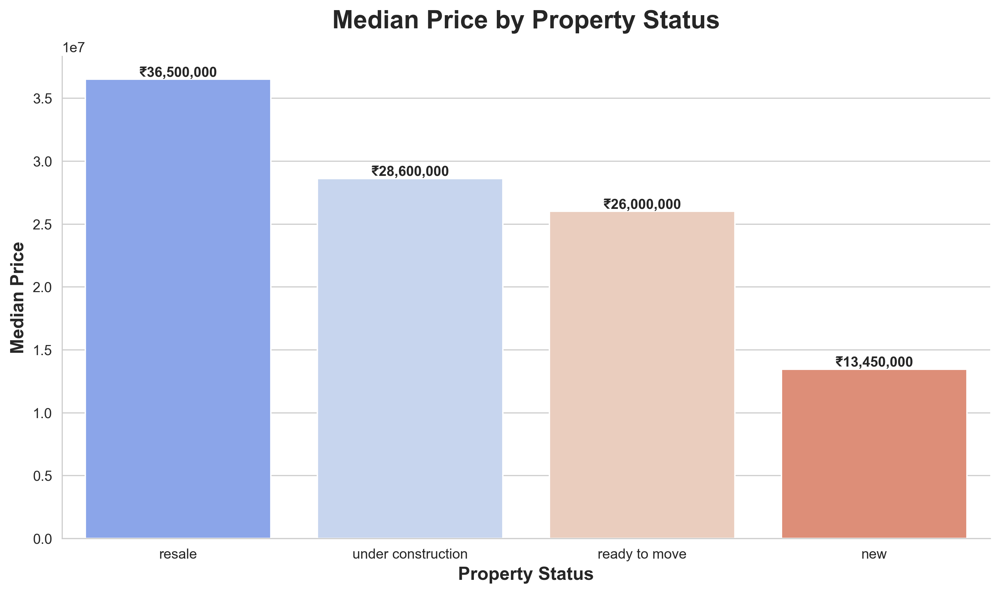

---

## Top Property Type Price

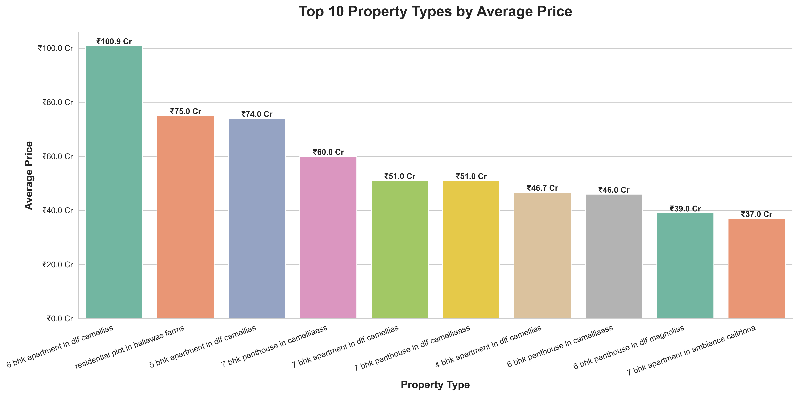

---

## Top Localities by Listings

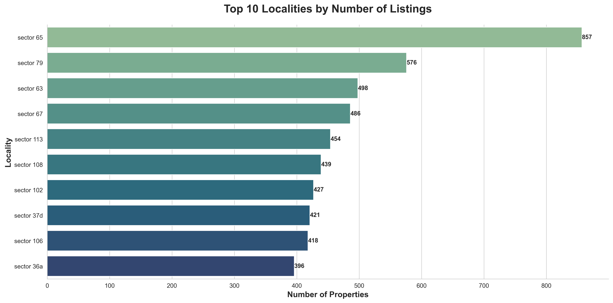

---

## Top 10 Builders Average Price


---

## Power BI Dashboard

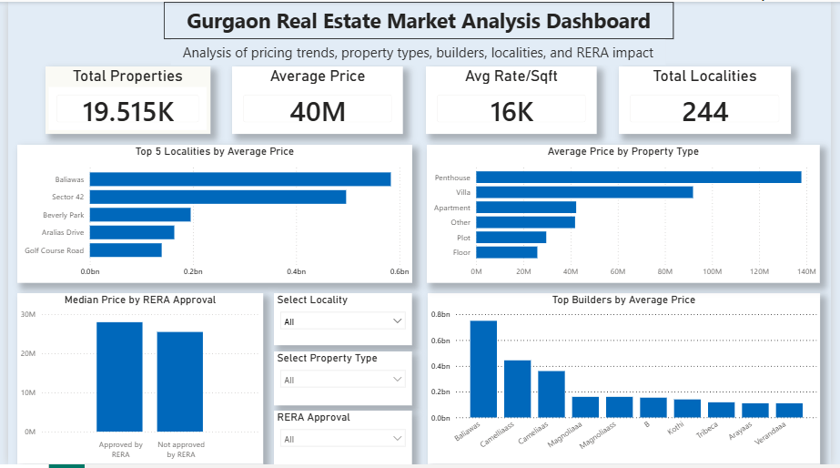

## Key Insights

- Premium localities command significantly higher property prices.
- RERA-approved properties generally have higher median prices.
- Builder reputation strongly impacts pricing.
- Area positively correlates with property price.
- Larger homes are not always more expensive per square foot.
- Apartments dominate the Gurgaon residential market.
- Higher BHK configurations tend to have higher average pricing.
- Ready-to-move properties generally cost more than under-construction properties.

---

## Conclusion

This project demonstrates practical Exploratory Data Analysis (EDA) skills using real-world real estate data.

The analysis helps identify:

- Premium investment locations
- Pricing trends
- Builder market positioning
- Property value drivers

This project showcases:

- Data cleaning
- Data analysis
- Visualization
- Business insight generation
- Professional project structuring

---

## Future Improvements

Possible future enhancements:

- Machine Learning price prediction model
- Power BI interactive dashboard
- Geospatial analysis
- Time-series market trend analysis
- Deployment using Streamlit or Flask

---

## Author

**Abhijeet Kumar Sinha**
